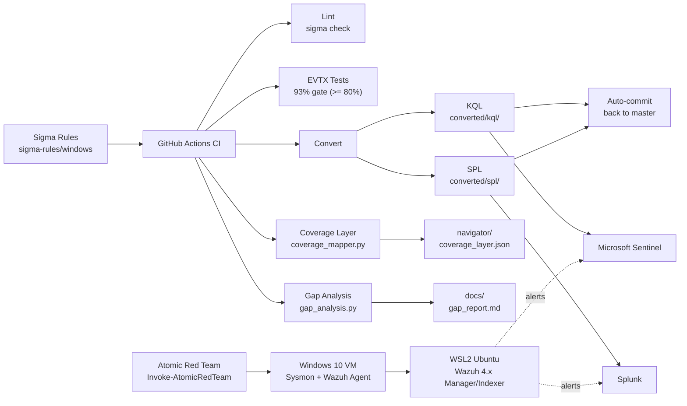
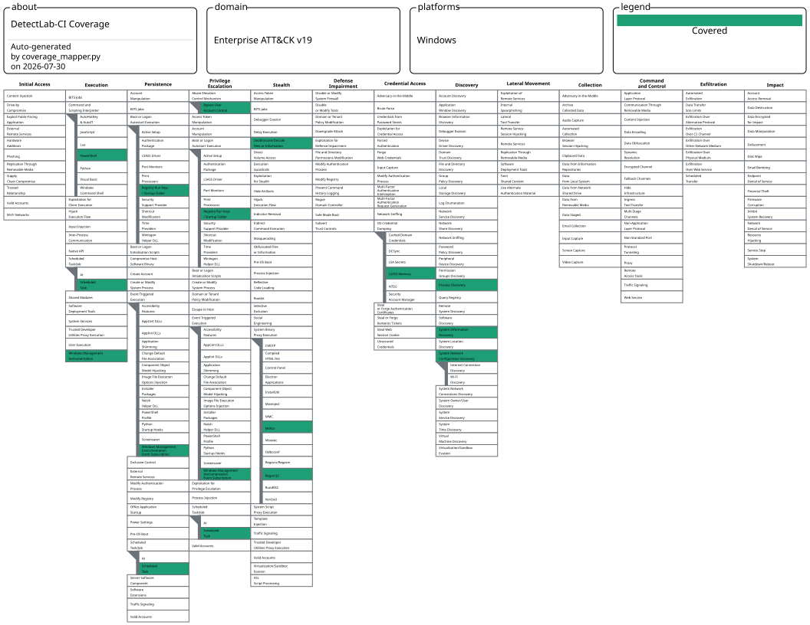
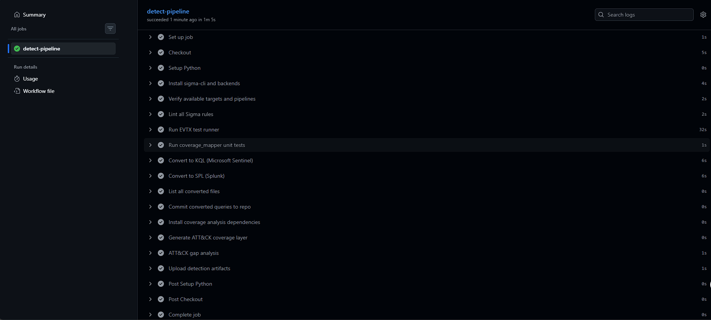

# DetectLab-CI

**Detection-as-code pipeline that turns Sigma rules into SIEM queries,
validates them against real-world EVTX telemetry in CI, and tracks
ATT&CK coverage automatically.**

[](https://github.com/cybersagnik/detect-lab-ci/actions)


---

## Overview

DetectLab-CI is a GitHub-native detection engineering workflow:

1. **Lint** every Sigma rule with `sigma check`.
2. **Validate** every rule against the
   [sbousseaden/EVTX-ATTACK-SAMPLES](https://github.com/sbousseaden/EVTX-ATTACK-SAMPLES)
   dataset — CI fails if detection rate drops below **80 %**.
3. **Convert** every rule into KQL (Microsoft Sentinel) and SPL (Splunk)
   via `sigma-cli` with the Sysmon pipeline, then auto-commit the
   regenerated queries back to `master`.
4. **Publish** an [ATT&CK Navigator](https://mitre-attack.github.io/attack-navigator/)
   layer and a gap report so coverage drift is visible in every PR.

Lab: Windows 10 VM (VirtualBox) running Sysmon (SwiftOnSecurity) +
Wazuh Agent, with Wazuh 4.x Manager/Indexer/Dashboard on WSL2 Ubuntu.
Adversary emulation uses Atomic Red Team via `Invoke-AtomicRedTeam`.

---

## Repository layout

```
detect-lab-ci/
├── sigma-rules/windows/            ← 14 hand-authored Sigma rules
│   ├── credential_access/             (1 rule)
│   ├── defence_evasion/               (3 rules — British spelling)
│   ├── discovery/                     (3 rules)
│   ├── execution/                     (3 rules)
│   ├── persistence/                   (3 rules)
│   └── privilege_escalation/          (1 rule)
├── converted/                      ← auto-generated by CI
│   ├── kql/windows/<tactic>/<rule>.txt
│   └── spl/windows/<tactic>/<rule>.txt
├── navigator/coverage_layer.json   ← ATT&CK Navigator layer
├── docs/
│   ├── atomic-results.md           ← ART validation log (14/14 fired)
│   ├── gap_report.md               ← coverage gap report (auto-generated)
│   ├── images/                     ← Wazuh alert + Navigator + CI screenshots
│   └── rules_rationale/            ← one .md per validated rule
├── scripts/
│   ├── test_runner.py              ← EVTX test runner (93% gate)
│   ├── coverage_mapper.py          ← ATT&CK Navigator layer generator
│   ├── gap_analysis.py             ← gap report generator
│   └── requirements.txt
├── tests/test_coverage_mapper.py   ← 31 regression tests
├── .github/workflows/detect-ci.yml ← single CI pipeline
└── EVTX-ATTACK-SAMPLES/            ← submodule (sbousseaden)
```

---

## Architecture



---

## Metrics at a glance

| Metric | Value |
|---|---|
| Sigma rules | **14** |
| MITRE sub-techniques covered | **13** |
| ATT&CK parent techniques covered | **12 / 176** Windows techniques (**6.82 %**) |
| MITRE tactics covered | **6 / 14** |
| EVTX detection rate | **93 %** (13 / 14 pass, ≥ 80 % gate) |
| Atomic Red Team validation | **14 / 14** rules fired in Wazuh |
| Generated KQL queries | 14 |
| Generated SPL queries | 14 |
| ATT&CK Navigator format | 4.5 |
| ATT&CK version | 19 |

---

## Detection coverage

Every rule is in `sigma-rules/`, exercised by `scripts/test_runner.py`
against the EVTX-ATTACK-SAMPLES submodule, converted to both KQL and
SPL by CI, and validated in the lab against Atomic Red Team.

| # | Tactic | Rule | Technique | Primary EID | ART | EVTX |
|---|---|---|---|---|---|---|
| 1 | execution | `powershell_encoded_command.yml` | T1059.001 — PowerShell | Sysmon 1 | ✓ | ✗ |
| 2 | execution | `powershell_download_cradle.yml` | T1059.001 — PowerShell | PS 4104 | ✓ | ✓ |
| 3 | execution | `wmic_process_creation.yml` | T1047 — WMI | Sysmon 1 | ✓ | ✓ |
| 4 | persistence | `scheduled_task_creation.yml` | T1053.005 — Scheduled Task | Sysmon 1 / Sec 4698 | ✓ | ✓ |
| 5 | persistence | `registry_run_key_persistence.yml` | T1547.001 — Registry Run Keys | Sysmon 13 (`registry_set`) | ✓ | ✓ |
| 6 | persistence | `wmi_event_subscription.yml` | T1546.003 — WMI Event Subscription | Sysmon 19/20/21 | ✓ | ✓ |
| 7 | credential_access | `lsass_process_access.yml` | T1003.001 — LSASS Memory | Sysmon 10 | ✓ | ✓ |
| 8 | privilege_escalation | `uac_bypass_fodhelper.yml` | T1548.002 — UAC Bypass | Sysmon 1 | ✓ | ✓ |
| 9 | discovery | `network_config_discovery.yml` | T1016 — Network Config Discovery | Sysmon 1 | ✓ | ✓ |
| 10 | discovery | `process_discovery_tasklist.yml` | T1057 — Process Discovery | Sysmon 1 | ✓ | ✓ |
| 11 | discovery | `systeminfo_execution.yml` | T1082 — System Info Discovery | Sysmon 1 | ✓ | ✓ |
| 12 | defence_evasion | `certutil_decode.yml` | T1140 — Deobfuscate/Decode | Sysmon 1 | ✓ | ✓ |
| 13 | defence_evasion | `mshta_proxy_execution.yml` | T1218.005 — Mshta | Sysmon 1 | ✓ | ✓ |
| 14 | defence_evasion | `regsvr32_proxy_execution.yml` | T1218.010 — Regsvr32 | Sysmon 1 | ✓ | ✓ |

The single failing EVTX test is `powershell_encoded_command` — the
runner maps it to a single sample which doesn't contain a
`-EncodedCommand` invocation. The rule is correct (verified by ART);
the EVTX mapping is the gap.

---

## ATT&CK Navigator layer

`navigator/coverage_layer.json` is regenerated on every push. Open it
in the [MITRE ATT&CK Navigator](https://mitre-attack.github.io/attack-navigator/)
(`domain = enterprise-attack`, `versions.attack = 19`,
`versions.navigator = 4.9`) — every covered sub-technique is coloured
green (`#1d9e75`) and the parent rows expand to show each child.



Layer breakdown: **20** total entries — **7** parent scaffolds
(`T1003`, `T1053`, `T1059`, `T1218`, `T1546`, `T1547`, `T1548`) and
**13** coloured leaf entries.

---

## Quick start

```bash
# 1. Clone with the EVTX test dataset as a submodule
git clone --recursive https://github.com/cybersagnik/detect-lab-ci.git
cd detect-lab-ci

# 2. Install Python deps (sigma-cli, backends, EVTX parser, pyyaml)
pip install -r scripts/requirements.txt

# 3. Validate all 14 rules against EVTX-ATTACK-SAMPLES
python scripts/test_runner.py

# 4. Convert every Sigma rule to KQL (Sentinel) and SPL (Splunk)
sigma convert -t kusto  -p sysmon sigma-rules/windows -o converted/kql
sigma convert -t splunk -p sysmon sigma-rules/windows -o converted/spl

# 5. Regenerate the ATT&CK Navigator layer
python scripts/coverage_mapper.py
```

`step 3` reports a detection rate — same logic as CI. After `step 5`,
open `navigator/coverage_layer.json` in the Navigator to render the
heatmap.

---

## Lab validation results

Validated end-to-end against the lab — full screenshots and field
observations live in [`docs/atomic-results.md`](docs/atomic-results.md).

| # | Technique | ART Test | Wazuh Alert | Primary EID | Rationale |
|---|---|---|---|---|---|
| 1 | T1059.001 — Encoded PowerShell | `T1059.001-17` | ✓ | Sysmon 1 | [link](docs/rules_rationale/T1059.001.md) |
| 2 | T1053.005 — Scheduled Task via schtasks | `T1053.005-1` | ✓ | Sysmon 1 | [link](docs/rules_rationale/T1053.005.md) |
| 3 | T1003.001 — LSASS Memory Access | `T1003.001-1` | ✓ | Sysmon 10 | [link](docs/rules_rationale/T1003.001.md) |
| 4 | T1547.001 — Registry Run Key Persistence | `T1547.001-1` | ✓ | Sysmon 13 | [link](docs/rules_rationale/T1547.001.md) |
| 5 | T1548.002 — UAC Bypass (fodhelper) | `T1548.002-3` | ✓ | Sysmon 1 | [link](docs/rules_rationale/T1548.002.md) |
| 6 | T1016 — Network Config Discovery | `T1016-1` | ✓ | Sysmon 1 | [link](docs/rules_rationale/T1016.md) |
| 7 | T1047 — WMIC Process Creation | `T1047-5` | ✓ | Sysmon 1 | [link](docs/rules_rationale/T1047.md) |
| 8 | T1057 — Process Discovery (tasklist) | `T1057-2` | ✓ | Sysmon 1 | [link](docs/rules_rationale/T1057.md) |
| 9 | T1059.001 — PowerShell Download Cradle | `T1059.001-1` | ✓ | PS 4104 | [link](docs/rules_rationale/T1059.001-DL.md) |
| 10 | T1082 — System Information Discovery | `T1082-1` | ✓ | Sysmon 1 | [link](docs/rules_rationale/T1082.md) |
| 11 | T1140 — Certutil Encode/Decode | `T1140-1` | ✓ | Sysmon 1 | [link](docs/rules_rationale/T1140.md) |
| 12 | T1218.005 — Mshta Proxy Execution | `T1218.005-1` | ✓ | Sysmon 1 | [link](docs/rules_rationale/T1218.005.md) |
| 13 | T1218.010 — Regsvr32 Proxy Execution | `T1218.010-1` | ✓ | Sysmon 1 | [link](docs/rules_rationale/T1218.010.md) |
| 14 | T1546.003 — WMI Event Subscription | `T1546.003-1` | ✓ | Sysmon 20 | [link](docs/rules_rationale/T1546.003.md) |

**Total ART-validated rules: 14 / 14.** Per-rule Wazuh dashboard
screenshots are in [`docs/images/`](docs/images/).

---

## Sigma → SIEM query example

`sigma-rules/windows/persistence/registry_run_key_persistence.yml`
(T1547.001) — detects a Run-key value being set, filters known-good
software, converts cleanly to both backends.

### Sigma (source of truth)

```yaml
title: Registry Run Key Persistence - Low FP
logsource:
  category: registry_set
  product: windows
detection:
  selection:
    TargetObject|contains:
      - '\Software\Microsoft\Windows\CurrentVersion\Run'
      - '\Software\Microsoft\Windows\CurrentVersion\RunOnce'
    EventType: 'SetValue'
  filter_known_good:
    Details|contains:
      - 'OneDrive'
      - 'SecurityHealth'
      - 'Windows Defender'
      - 'Teams'
      - 'AdobeGCInvoker'
  condition: selection and not filter_known_good
tags:
  - attack.persistence
  - attack.t1547.001
```

### KQL (Microsoft Sentinel) — `converted/kql/windows/persistence/registry_run_key_persistence.txt`

```kql
EventID == 13
and (((TargetObject contains "\\Software\\Microsoft\\Windows\\CurrentVersion\\Run"
   or TargetObject contains "\\Software\\Microsoft\\Windows\\CurrentVersion\\RunOnce")
   and EventType =~ "SetValue")
   and (not((Details contains "OneDrive"
          or Details contains "SecurityHealth"
          or Details contains "Windows Defender"
          or Details contains "Teams"
          or Details contains "AdobeGCInvoker"))))
```

### SPL (Splunk) — `converted/spl/windows/persistence/registry_run_key_persistence.txt`

```spl
EventID=13 (TargetObject="*\\Software\\Microsoft\\Windows\\CurrentVersion\\Run*"
            OR TargetObject="*\\Software\\Microsoft\\Windows\\CurrentVersion\\RunOnce*")
            EventType="SetValue"
            NOT (Details="*OneDrive*"
                 OR Details="*SecurityHealth*"
                 OR Details="*Windows Defender*"
                 OR Details="*Teams*"
                 OR Details="*AdobeGCInvoker*")
```

Same rule, two SIEMs, regenerated on every push.

---

## CI pipeline screenshot



> checkout → lint → test runner →
> unit tests → KQL convert → SPL convert → auto-commit → coverage →
> gap analysis → upload artifacts) passing._

Pipeline definition: [`.github/workflows/detect-ci.yml`](.github/workflows/detect-ci.yml).

---

## Adding a new rule

1. Drop the `.yml` under `sigma-rules/windows/<tactic>/`.
2. Append a `RULE_TO_EVTX` entry in `scripts/test_runner.py` with at
   least one EVTX path.
3. Run `python scripts/test_runner.py` locally — confirm PASS.
4. Add a rationale doc under `docs/rules_rationale/T####.md`.
5. Open a PR — CI will lint, EVTX-test, convert, regenerate the
   Navigator layer and gap report.

---

## Credits

- EVTX test dataset: [sbousseaden/EVTX-ATTACK-SAMPLES](https://github.com/sbousseaden/EVTX-ATTACK-SAMPLES).
- Adversary emulation: [Atomic Red Team](https://github.com/redcanaryco/atomic-red-team).
- Sigma tooling: [SigmaHQ/pySigma](https://github.com/SigmaHQ/pySigma).
- ATT&CK visualisation: [MITRE ATT&CK Navigator](https://github.com/mitre-attack/attack-navigator).
- Lab SIEM: [Wazuh](https://wazuh.com/) 4.x on WSL2 Ubuntu.
