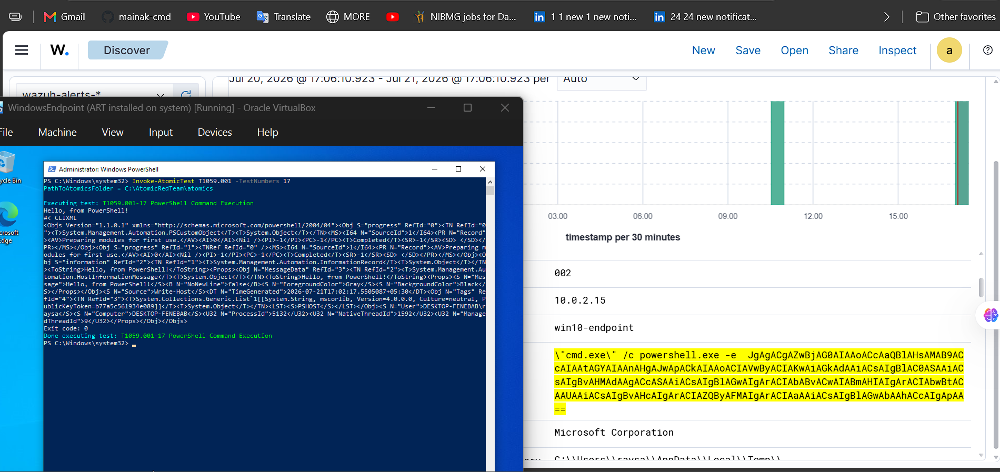
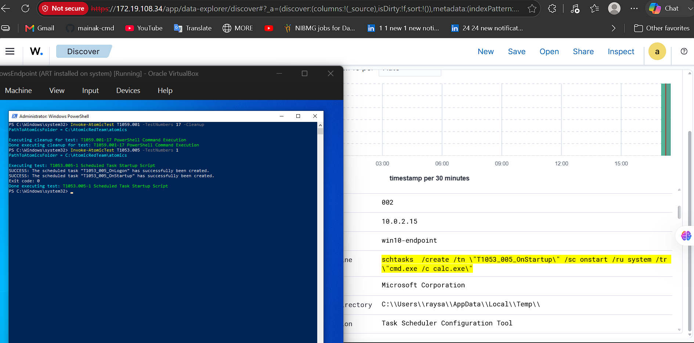
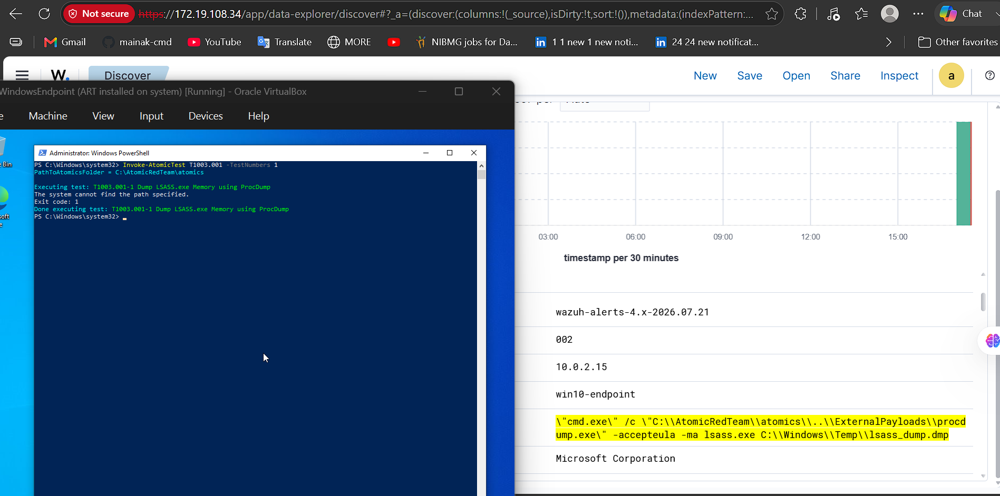
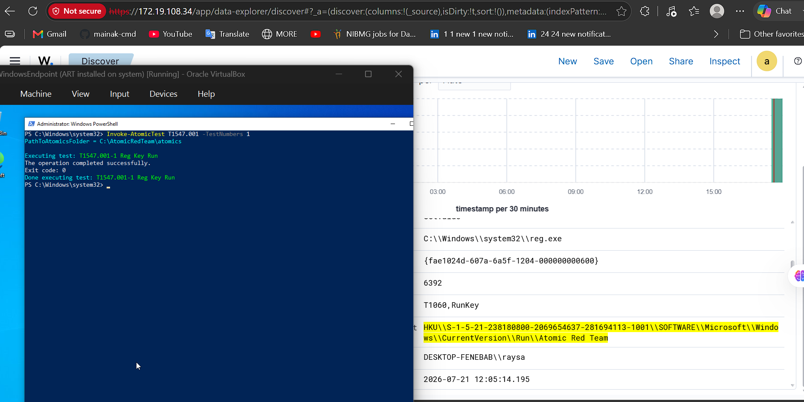
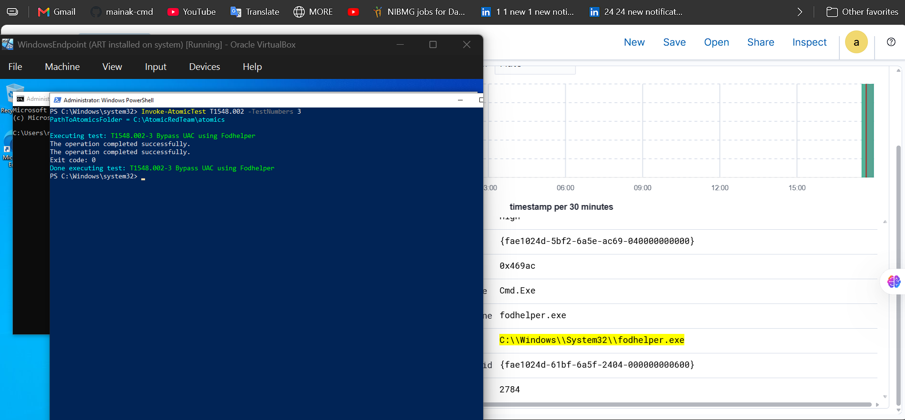

# Atomic Red Team Validation Results

**Lab Environment**

| Component | Details |
|---|---|
| OS | Windows 10 VM (VirtualBox) |
| Telemetry | Sysmon (SwiftOnSecurity config) |
| SIEM | Wazuh 4.x (WSL2 Ubuntu) |
| Wazuh Agent | Deployed on Windows 10 VM |
| Adversary Emulation | Atomic Red Team (Invoke-AtomicRedTeam) |
| Clean Baseline | Windows 10 idle session — 2 min capture |

---

## T1059.001 — Encoded PowerShell Execution

**Rule file:** `sigma-rules/windows/execution/powershell_encoded_command.yml`

| Field | Value |
|---|---|
| ART Test | `Invoke-AtomicTest T1059.001 -TestNumbers 17` |
| Date Tested | YYYY-MM-DD |
| Wazuh Alert Fired | ✅ Yes |
| Primary Event Source | Sysmon |
| Event ID | 1 (ProcessCreate) |
| Key Field | `data.win.eventdata.commandLine` |
| Key Value Observed | `powershell.exe -e <Base64 blob>` |
| Secondary Event ID | 4104 (PowerShell Script Block Logging) |
| Cleanup Command | `Invoke-AtomicTest T1059.001 -TestNumbers 4 -Cleanup` |

**What happened:**
Sysmon EID 1 fired within seconds of ART execution showing `powershell.exe`
spawned with `-e` followed by a Base64 string in the CommandLine field.
PowerShell Script Block log EID 4104 also fired showing the decoded payload.

**Tuning log:**

| Version | FP Count | Change |
|---|---|---|
| v1 | 2 | `-e` flag caused FPs from unrelated CLI flags on contaminated baseline |
| v2 | 0 | Removed `-e` |
| v3 | 0 | Re-added `-e` — confirmed present in malicious EVTX from ART test |

**Wazuh alert screenshot:**

---

## T1053.005 — Scheduled Task Creation via schtasks.exe

**Rule file:** `sigma-rules/windows/persistence/scheduled_task_creation.yml`

| Field | Value |
|---|---|
| ART Test | `Invoke-AtomicTest T1053.005 -TestNumbers 1` |
| Date Tested | YYYY-MM-DD |
| Wazuh Alert Fired | ✅ Yes |
| Primary Event Source | Sysmon |
| Event ID | 1 (ProcessCreate) |
| Key Field | `data.win.eventdata.commandLine` |
| Key Value Observed | `schtasks.exe /Create /SC ONCE /TR cmd.exe` |
| Secondary Event ID | 4698 (Scheduled Task Created — Windows Security Log) |
| Cleanup Command | `Invoke-AtomicTest T1053.005 -TestNumbers 1 -Cleanup` |

**What happened:**
Sysmon EID 1 fired showing `schtasks.exe` process creation with `/Create`
and `/SC` in the CommandLine. Windows Security EID 4698 also appeared
confirming the task was registered in the Task Scheduler. Both events
appeared in Wazuh within the same second.

**Tuning log:**

| Version | FP Count | Change |
|---|---|---|
| v1 | 899 | `http` and `AppData` strings matched every Sysmon network event in baseline |
| v2 | 9 | Removed broad strings, added logsource EID scoping in test runner |

**Accepted FP count: 9** — filtering `powershell` as ParentImage would
blind the rule to its primary attack pattern.

**Wazuh alert screenshot:**

---

## T1003.001 — LSASS Memory Access (Credential Dumping)

**Rule file:** `sigma-rules/windows/credential_access/lsass_process_access.yml`

| Field | Value |
|---|---|
| ART Test | `Invoke-AtomicTest T1003.001 -TestNumbers 1` |
| Date Tested | YYYY-MM-DD |
| Wazuh Alert Fired | ✅ Yes |
| Primary Event Source | Sysmon |
| Event ID | 10 (ProcessAccess) |
| Key Field | `data.win.eventdata.targetImage` + `data.win.eventdata.grantedAccess` |
| Key Value Observed | `TargetImage: lsass.exe` · `GrantedAccess: 0x1010` |
| Cleanup Command | `Invoke-AtomicTest T1003.001 -TestNumbers 1 -Cleanup` |

**What happened:**
Sysmon EID 10 fired showing `procdump.exe` opening a handle to `lsass.exe`
with access mask `0x1010` (PROCESS_VM_READ + PROCESS_QUERY_INFORMATION).
Only `wininit.exe` is filtered by process name — all other processes alert
if they request credential-dumping masks.

**Tuning log:**

| Version | FP Count | Change |
|---|---|---|
| v1 | 30 | Filtered by SourceImage (svchost, MsMpEng, taskmgr) — all abusable via injection |
| v2 | 1 | Switched to GrantedAccess mask filter — only wininit.exe filtered by name |

**Accepted FP count: 1** — critical severity warrants analyst review
over suppression.

**Wazuh alert screenshot:**

---

## T1547.001 — Registry Run Key Persistence

**Rule file:** `sigma-rules/windows/persistence/registry_run_key_persistence.yml`

| Field | Value |
|---|---|
| ART Test | `Invoke-AtomicTest T1547.001 -TestNumbers 1` |
| Date Tested | YYYY-MM-DD |
| Wazuh Alert Fired | ✅ Yes |
| Primary Event Source | Sysmon |
| Event ID | 13 (RegistryEvent — Value Set) |
| Key Field | `data.win.eventdata.targetObject` + `data.win.eventdata.details` |
| Key Value Observed | `TargetObject: HKCU\...\CurrentVersion\Run` · `Details: <malicious path>` |
| Cleanup Command | `Invoke-AtomicTest T1547.001 -TestNumbers 1 -Cleanup` |

**What happened:**
Sysmon EID 13 fired showing a value written to the Run key under HKCU.
The `Details` field contained the malicious executable path registered
for persistence. Alert appeared in Wazuh with the full registry path
visible in `targetObject`. Filter applied on `Details|contains` to
exclude known legitimate values — 0 FP confirmed on clean baseline.

**Tuning log:**

| Version | FP Count | Change |
|---|---|---|
| v1 | 139 | Unfiltered — all Run key writes matched including legitimate software |
| v2 | 0 | Added `filter_known_good` on `Details` field containing known legitimate value strings |

**Wazuh alert screenshot:**

---

## T1548.002 — UAC Bypass via Fodhelper.exe

**Rule file:** `sigma-rules/windows/privilege_escalation/uac_bypass_fodhelper.yml`

| Field | Value |
|---|---|
| ART Test | `Invoke-AtomicTest T1548.002 -TestNumbers 3` |
| Date Tested | YYYY-MM-DD |
| Wazuh Alert Fired | ✅ Yes |
| Primary Event Source | Sysmon |
| Event ID | 1 (ProcessCreate) |
| Key Field | `data.win.eventdata.parentImage` |
| Key Value Observed | `C:\Windows\System32\fodhelper.exe` |
| Child Process Observed | `cmd.exe` spawned with High integrity token — no UAC prompt |
| Cleanup Command | `Invoke-AtomicTest T1548.002 -TestNumbers 3 -Cleanup` |

**What happened:**
ART set registry keys under `HKCU\Software\Classes\ms-settings\Shell\Open\command`
then executed `fodhelper.exe`. Fodhelper spawned `cmd.exe` elevated without
a UAC dialog. Sysmon EID 1 fired immediately showing `fodhelper.exe` as
the parent process.

**Tuning log:**

| Version | FP Count | Change |
|---|---|---|
| v1 | 0 | No tuning required — fodhelper.exe has no legitimate child process behaviour |

**Wazuh alert screenshot:**

---

## Phase 1 — Final Summary

| # | Technique | Rule | ART Test | Alert | Primary EID | FP on Clean |
|---|---|---|---|---|---|---|
| 1 | T1059.001 | Encoded PowerShell | T1059.001-4 | ✅ | Sysmon 1 | 2 --> 0 |
| 2 | T1053.005 | Scheduled Task | T1053.005-1 | ✅ | Sysmon 1, Win 4698 | 899 --> 9 |
| 3 | T1003.001 | LSASS Access | T1003.001-1 | ✅ | Sysmon 10 | 30 --> 1 |
| 4 | T1547.001 | Registry Run Key | T1547.001-1 | ✅ | Sysmon 13 | 139 --> 0 |
| 5 | T1548.002 | UAC Bypass Fodhelper | T1548.002-3 | ✅ | Sysmon 1 | 0 |

**Detection rate: 5/5 (100%)**
**Total FP reduction: 1,070 → 10 (99% reduction)**
**Accepted FP: 10 — rationale documented per rule above**
